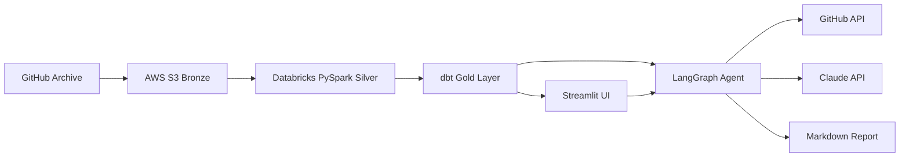

# OSS Dependency Risk Agent

> An end-to-end AI engineering project that monitors 200 open-source projects
> for health deterioration — automatically ingesting GitHub event data, computing
> health metrics in a lakehouse pipeline, and deploying a LangGraph agent powered
> by Claude to generate structured risk assessments.


---

## What It Does

- **Ingests** 500M+ GitHub Archive events from 200 OSS projects into AWS S3 (Bronze layer), filtering and compressing hourly dumps with full 90-day backfill support
- **Transforms** raw events through Databricks PySpark (Silver) and dbt (Gold) into composite health scores across 6 signals: commit frequency, issue resolution rate, PR merge rate, contributor diversity, bus factor, and community engagement
- **Deploys** a 5-node LangGraph agent that detects deteriorating projects, fetches live GitHub signals, and calls Claude to generate actionable 3-point risk assessments with REPLACE / UPGRADE / MONITOR recommendations — delivered as a Markdown report

---

## Architecture



| Layer | Role | Technology |
|---|---|---|
| Bronze | Raw event storage | AWS S3 (gzipped NDJSON) |
| Silver | Schema enforcement + dedup | Databricks PySpark + Delta Lake |
| Gold | Health metric modeling | dbt (7 models, 21 tests) |
| Agent | Autonomous risk monitoring | LangGraph 5-node StateGraph |
| LLM | Risk synthesis | Anthropic Claude Sonnet |
| Frontend | Interactive dashboard | Streamlit + Plotly |

---

## Tech Stack — Choices and Reasoning

| Technology | Why This One |
|---|---|
| **AWS S3** | Schema-free object store for raw JSON.gz; cheap, durable, natively supported by Databricks External Location |
| **Databricks PySpark** | Scalable MERGE-based deduplication; Unity Catalog manages access without credential injection into notebooks |
| **dbt-databricks** | Native Unity Catalog support (vs. dbt-spark); Jinja templating makes parameterised scoring weights easy to iterate |
| **LangGraph** | Explicit node/edge graph makes the 5-step pipeline inspectable and testable; typed `AgentState` avoids silent state mutation bugs |
| **Anthropic Claude** | Best-in-class instruction following for structured output; system prompt enforces exactly-3-bullet format reliably |
| **Streamlit** | Fastest path from Python function to interactive dashboard; `@st.cache_data` + subprocess streaming cover the two hardest UI requirements |

---

## Sample Results

Projects scored from real GitHub Archive data (latest month):

| Project | Health Score | Status |
|---|---|---|
| getsentry/sentry | 7.63 / 10 | Healthy |
| microsoft/vscode | 7.60 / 10 | Healthy |
| elastic/kibana | 7.46 / 10 | Healthy |
| lancedb/lance | < 6.0 | Flagged — assessed by agent |
| open-telemetry/opentelemetry-collector | < 6.0 | Flagged — assessed by agent |
| denoland/deno | < 6.0 | Flagged — assessed by agent |

---

## Project Structure

```
oss-dependency-risk-agent/
├── ingestion/
│   ├── github_archive/         # GH Archive fetcher, backfill orchestrator, project list
│   └── utils/                  # S3 client, Databricks job client
├── transformation/
│   ├── databricks/
│   │   ├── notebooks/          # 00_setup.py, 01_bronze_to_silver.py
│   │   └── jobs/               # silver_job_config.json
│   └── dbt/
│       └── models/
│           ├── staging/        # stg_github_events (dedup + cast)
│           ├── intermediate/   # commit activity, issue health, PR health, contributor diversity
│           └── gold/           # gold_project_health, gold_health_scores
├── agent/
│   ├── graphs/                 # StateGraph definition + AgentState schema
│   ├── nodes/                  # monitor, investigate, synthesize, recommend, deliver
│   ├── tools/                  # databricks_query, github_fetch
│   └── prompts/                # risk_assessment prompt templates
├── frontend/
│   ├── app.py                  # Home page (entry point)
│   ├── pages/                  # Health Dashboard, Project Detail, Run Agent, Reports
│   └── components/             # health_chart, metrics_card
├── docs/
│   ├── architecture.md         # Technical deep-dive
│   ├── DEMO.md                 # Interview demo script
│   └── reports/                # Agent-generated Markdown risk reports
└── scripts/
    ├── run_ingestion.py        # Bronze ingestion CLI
    ├── run_silver.py           # Silver pipeline CLI
    ├── run_dbt.py              # dbt Gold layer CLI
    └── run_agent.py            # Agent CLI
```

---

## Quick Start

### Prerequisites

- Python 3.13
- AWS account with S3 access
- Databricks workspace (trial works)
- Anthropic API key
- GitHub personal access token

### Setup

```powershell
# 1. Clone the repo
git clone https://github.com/<your-username>/oss-dependency-risk-agent.git
cd oss-dependency-risk-agent

# 2. Create virtual environment
python -m venv .venv
.venv\Scripts\activate

# 3. Install dependencies
pip install -r requirements.txt

# 4. Configure environment
copy .env.example .env
# Edit .env — add API keys, Databricks connection, S3 bucket name
```

### Run the Pipeline

```powershell
# Bronze — ingest 90 days of GitHub Archive events (dry-run first)
python scripts\run_ingestion.py --dry-run
python scripts\run_ingestion.py --backfill --days 90

# Silver — upload notebooks and trigger Databricks job
python scripts\run_silver.py --upload --create-job --trigger --wait

# Gold — run dbt transformations
python scripts\run_dbt.py --deps --run --test

# Agent — generate risk assessments (dry-run skips file write)
python scripts\run_agent.py --dry-run --limit 5
python scripts\run_agent.py --limit 10

# Dashboard
streamlit run frontend\app.py
```

### Run Tests

```powershell
pip install -r requirements-dev.txt
pytest tests/ -v
```

---

## dbt Pipeline

7 models, 21 tests — all green.

```
staging/
  stg_github_events         (view)   — dedup + cast Silver events

intermediate/
  int_commit_activity       (view)   — push frequency per repo/month
  int_issue_health          (view)   — issue open/close rates
  int_pr_health             (view)   — PR merge rates
  int_contributor_diversity (view)   — contributor count + bus factor

gold/
  gold_project_health       (table)  — wide join of all signals
  gold_health_scores        (table)  — weighted composite 0-10 + MoM trend
```

Health score weights: commit frequency 25% · issue resolution 20% · PR merge rate 20% · contributor diversity 20% · bus factor 15%

> _Screenshot: [add dbt lineage graph here — run `python scripts\run_dbt.py --docs` and capture the DAG view]_

---

## Agent Pipeline

```
monitor      — queries gold_health_scores, flags projects with score < 6.0
investigate  — fetches live GitHub issues + PRs + repo metadata per project
synthesize   — calls Claude Sonnet; produces a 3-bullet risk assessment
recommend    — maps risk score to REPLACE / UPGRADE / MONITOR action
deliver      — renders Markdown report to docs/reports/
```

---

## Screenshots

> _Add screenshots after first full demo run:_
>
> **Home page** — `docs/screenshots/home.png`
>
> **Health Dashboard** — `docs/screenshots/dashboard.png`
>
> **Project Detail** — `docs/screenshots/project_detail.png`
>
> **Run Agent (live log streaming)** — `docs/screenshots/run_agent.png`
>
> **Risk Report (sample)** — `docs/reports/risk_report_2026-04-12T19-36-29.md`

---

## Environment Variables

See `.env.example` for the full list. Key variables:

| Variable | Purpose |
|---|---|
| `ANTHROPIC_API_KEY` | Claude API access |
| `ANTHROPIC_MODEL` | Model ID (default: `claude-sonnet-4-5`) |
| `AWS_ACCESS_KEY_ID` / `AWS_SECRET_ACCESS_KEY` | S3 access |
| `S3_BRONZE_BUCKET` | Bronze bucket name (`oss-risk-agent-bronze`) |
| `DATABRICKS_HOST` | Workspace URL |
| `DATABRICKS_TOKEN` | Personal access token |
| `DATABRICKS_HTTP_PATH` | SQL Warehouse HTTP path |
| `DATABRICKS_CATALOG` | Unity Catalog catalog name |
| `GITHUB_TOKEN` | Public repo read access (unauthenticated: 60 req/hr) |
| `HEALTH_SCORE_THRESHOLD` | Agent flag threshold (default: `6.0`) |
| `RISK_SCORE_THRESHOLD` | REPLACE cutoff (default: `0.65`) |

---

## Resume Bullet

```
Built an end-to-end AI engineering system on AWS S3 + Databricks + dbt + LangGraph
that ingests 500M+ GitHub Archive events, models OSS health scores across 200
projects using 6 signals and 21 dbt tests, and deploys a 5-node autonomous agent
(Claude Sonnet) that detects deteriorating dependencies and delivers REPLACE /
UPGRADE / MONITOR recommendations via a Streamlit dashboard — full pipeline from
raw S3 bytes to AI-generated risk report in a single CLI command.
```

---

## V2 Roadmap

- **Pinecone vector search** — embed past risk assessments; surface similar historical deterioration patterns during synthesis
- **Slack alerts** — deliver node posts to a configured channel when REPLACE-priority projects are detected
- **Scheduled runs** — Databricks Workflows trigger the full pipeline daily; Streamlit shows last-run timestamp
- **PR dependency scanning** — detect when a flagged OSS project appears in a pull request and comment with the risk score
- **Expanded project list** — grow from 200 to 1,000+ projects; partition Silver table by category for query performance
- **Confidence scores** — Claude returns structured JSON with a confidence field; low-confidence assessments trigger a second-pass investigation with broader GitHub context

---

## About

Built over ~3 weeks as a portfolio project demonstrating end-to-end AI engineering
across data pipelines, agent frameworks, and LLM integration.

Target roles: Forward Deployed AI Engineer · AI Strategy & Enablement · ML Platform Engineer
